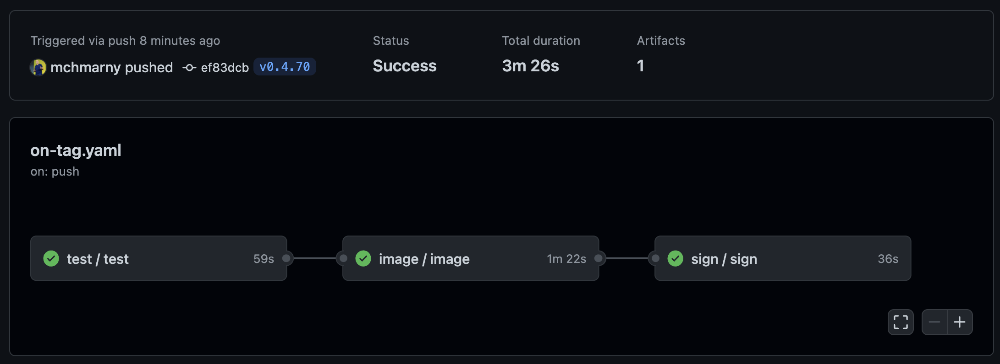

# hellow

Demo repo used to illustrate build pipeline using [Cloud Build](https://cloud.google.com/build) and [GitHub Actions](https://github.com/features/actions). In both cases, the image is pushed to [Artifact Registry](https://cloud.google.com/artifact-registry):

* Signed based on published image digest
* SBOM is generated from the signed image for all image layers in JSON format ([SPDX schema ](https://github.com/spdx/spdx-spec/blob/v2.2/schemas/spdx-schema.json))
* Attestation is created for that container image with the SBOM as predicate, and push it to registry 
* Image is scanned using SBOM content for vulnerabilities
* Attestation of the vulnerability report is push it to registry 

## Cloud Build

Cloud Build based pipeline uses pipeline defined in the [cloudbuild.yaml](cloudbuild.yaml) file. To setup Cloud Build trigger with Cloud Deploy pipeline for GKE cluster see [cloudbuild-demo](https://github.com/mchmarny/cloudbuild-demo).

## GitHub Actions

GitHub Actions based pipeline uses [a collection of reusable actions](.github/workflows/on-tag.yaml) triggered by on git tag. To setup GCP OpenID Connect (OIDC) provider for GitHub Actions workflows using Terraform take look [mchmarny/oidc-for-gcp-using-terraform](https://github.com/mchmarny/oidc-for-gcp-using-terraform) repo.

## Local Dev Using Skaffold

> Assumes the `kind` cluster is already set up. (`cluster/cluster-up`)

Make sure the `kubectl` context is set to the local cluster.

`kubectx`

If not, set it.

`kubectx kind-dev`

Launch `skaffold` in dev mode.

`skaffold dev --cache-artifacts=false`

Code changes will result in new image build and deploy. You can also run it using profiles.

`skaffold run --profile prod --tail`

To output the configuration (either `helm`, `kpt`, or `kustomize`).

> local image cause the kind cluster configured for local Docker registry

`skaffold render` or `o demo.yaml`

You can apply `demo.yaml` using `skaffold apply demo.yaml` or `kubectl`.

## Local Dev Using Makefile 

* Test: `make test`
* Lint: `make lint`
* Run un-compiled code: `make run`
* Image using Docker: `make iamge`
* Image using ko and sign image using cosign: `make publish`

For more commands run `make`

## Disclaimer

This is my personal project and it does not represent my employer. While I do my best to ensure that everything works, I take no responsibility for issues caused by this code.